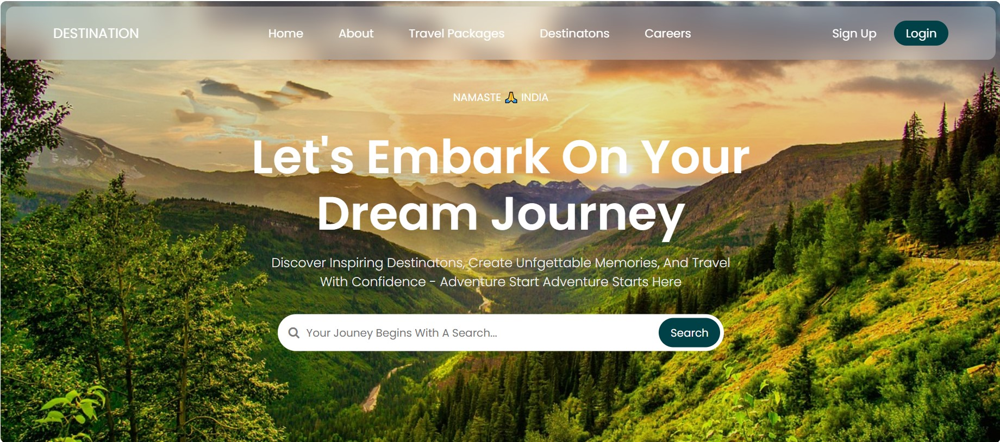

# Travel Blog - Destination Explorer

## Screenshot

## Overview
Destination Explorer is a beautifully designed travel blog website that allows users to discover inspiring destinations, create unforgettable memories, and travel with confidence. The platform provides users with travel packages, destination insights, and career opportunities.

## Features
- Stunning and responsive design
- Search functionality for travel destinations
- User authentication (Sign Up/Login)
- Navigation bar with multiple sections (Home, About, Travel Packages, Destinations, Careers)
- Eye-catching banner with a welcoming message

## License
This project is licensed under the MIT License.

